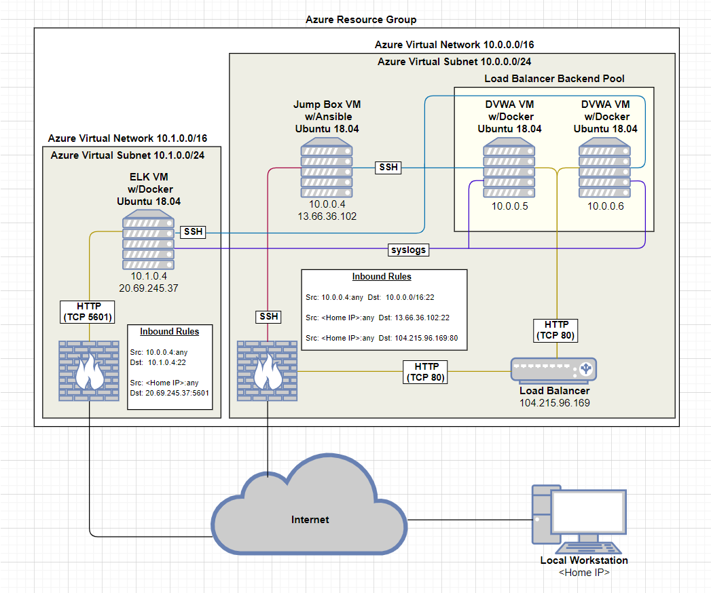
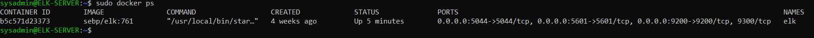
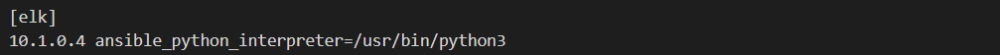
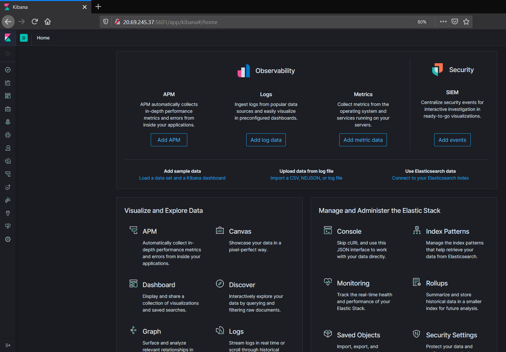
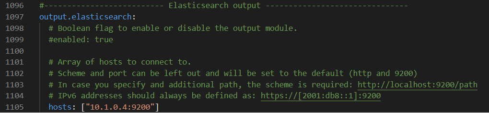
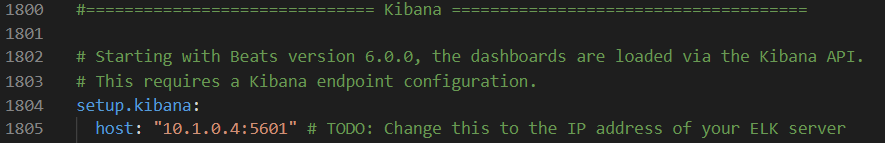

## Automated ELK Stack Deployment

The files in this repository were used to configure the network depicted below.

These files have been tested and used to generate a live ELK deployment on Azure. They can be used to either recreate the entire deployment pictured above. Alternatively, select portions of the repo may be used to install only certain pieces of it, such as Filebeat.

  - [DVWA Webservers Playbook](Ansible/roles/webservers.yml)
  - [ELK Server Playbook](Ansible/roles/elkserver.yml)
  - [Filebeat Playbook](Ansible/roles/filebeat-playbook.yml)
  - [Metricbeat Playbook](Ansible/roles/metricbeat-playbook.yml)

This document contains the following details:
- Description of the Topology
- Access Policies
- ELK Configuration
  - Beats in Use
  - Machines Being Monitored
- How to Use the Ansible Build

### Description of the Topology

The main purpose of this network is to expose a load-balanced and monitored instance of DVWA, the D*mn Vulnerable Web Application.

Load balancing ensures that the application will be highly available, in addition to restricting access to the network.

Integrating an ELK server allows users to easily monitor the vulnerable VMs for changes to the system logs and system services.

The configuration details of each machine may be found below.

| Name       | Function   | Private IP Address | Public IP Address                | Operating System |
|------------|------------|--------------------|----------------------------------|------------------|
| Jump Box   | Gateway    | `10.0.0.4`         | `13.66.36.102`                   | Linux 18.04      |
| Elk Server | ELK Stack  | `10.1.0.4`         | `20.69.245.37`                   | Linux 18.04      |
| Web-1      | Web Server | `10.0.0.5`         | `104.215.96.169` (Load Balancer) | Linux 18.04      |
| Web-2      | Web Server | `10.0.0.6`         | `104.215.96.169` (Load Balancer) | Linux 18.04      |

### Access Policies

The machines on the internal network are not exposed to the public Internet. 

Only the Jump Box and the ELK Server can accept connections from the Internet. Access to this machine is only allowed from the following IP address:
- My `<Home-IP>` address

Machines within the network can only be accessed by the Jump Box (10.0.0.4). The default Azure Security Group rules for each virtual network deny all traffic inbound from the Internet except where specified by an inbound rule, while allowing inbound/outbound within each network and outbound to the Internet. Relevant inbound security group rules are found in the table below. 

| Network       | Rule Name         | Port | Source      | Destination      | Action | 
|---------------|-------------------|------|-------------|------------------|--------|
| `10.0.0.0/16` | SSH to Jump Box   | 22   | `<Home-IP>` | `10.0.0.4`       | Allow  |
| `10.0.0.0/16` | SSH from Jump Box | 22   | `10.0.0.4`  | `10.0.0.0/16`    | Allow  |
| `10.0.0.0/16` | Allow HTTP        | 80   | `<Home-IP>` | `104.215.96.169` | Allow  |
| `10.1.0.0/16` | SSH from Jump Box | 22   | `10.0.0.4`  | `10.1.0.0/16`    | Allow  |
| `10.1.0.0/16` | Allow 5601        | 5601 | `<Home-IP>` | `10.1.0.4`       | Allow  |

A summary of the access policies in place can be found in the table below.

| Name       | Publicly Accessible | Allowed IP Addresses |
|------------|---------------------|----------------------|
| Jump Box   | Yes                 | `<Home-IP>`          |
| ELK Server | Yes                 | `<Home-IP>`          |
| Web-1      | No                  | `10.0.0.4`           |
| Web-2      | No                  | `10.0.0.4`           |

### Elk Configuration

Ansible was used to automate configuration of the ELK machine. No configuration was performed manually, which is advantageous because Infrastructure as Code (Iac) is a powerful way to build, maintain, and scale systems consistently and efficiently. 

The playbook implements the following tasks:
- Use apt module to install Docker and Pip3
- Use pip module to install Docker Python
- Use sysctl module to expand system memory
- Use docker_container module to install and launch Docker container with ELK
- Use systemd module to enable Docker service on reboot

The following screenshot displays the result of running `docker ps` after successfully configuring the ELK instance.

### Target Machines & Beats
This ELK server is configured to monitor the following machines:
- Web-1: `10.0.0.5`
- Web-2: `10.0.0.6`

We have installed the following Beats on these machines:
- Filebeat
- Metricbeat

These Beats allow us to collect the following information from each machine for monitoring and visualization on the ELK dashboard:
- Filebeat collects system logs and files
- Metricbeat collects system and service metrics and statistics

### Using the Playbook
In order to use the playbook, you will need to have an Ansible control node already configured. Assuming you have such a control node provisioned: 

SSH into the control node and follow the steps below:
- Copy the `Ansible/roles/elkserver.yml` file to the `/etc/ansible/roles/` directory:
  - `$ sudo docker cp elkserver.yml <CONTAINER-NAME>:/etc/ansible/roles/elkserver.yml`
- Once attached to the Docker container, update the `hosts` file to include the ELK VM IP address: 
  
- Run the playbook to configure the ELK Server VM:
  - `$ ansible-playbook /etc/ansible/roles/elkserver.yml`
- Once configuration is completed, navigate to `http://<ELK-PUBLIC-IP>:5601/app/kibana` to check that the installation worked as expected:
   

To install the Filebeat and Metricbeat playbooks, SSH into the control node and follow the steps below: 
- Copy the `Ansible/roles/filebeat-playbook.yml` and `Ansible/roles/metricbeat-playbook.yml` file to the `/etc/ansible/roles` directory: 
  - `$ sudo docker cp filebeat-playbook.yml <CONTAINER-NAME>:/etc/ansible/roles/filebeat-playbook.yml` 
  - `$ sudo docker cp metricbeat-playbook.yml <CONTAINER-NAME>:/etc/ansible/roles/metricbeat-playbook.yml` 
- Copy the `Ansible/files` directory containing the Filebeat and Metricbeat config files: 
  - `$ sudo docker cp Ansible/files/* <CONTAINER-NAME>:/etc/ansible/files/`
- Once attached to the Docker container, update the config files for Filebeat and Metricbeat with the ELK VM IP address: 
  
  
- Run each playbook to install: 
  - `$ ansible-playbook /etc/ansible/roles/filebeat-playbook.yml`
  - `$ ansible-playbook /etc/ansible/roles/metricbeat-playbook.yml`